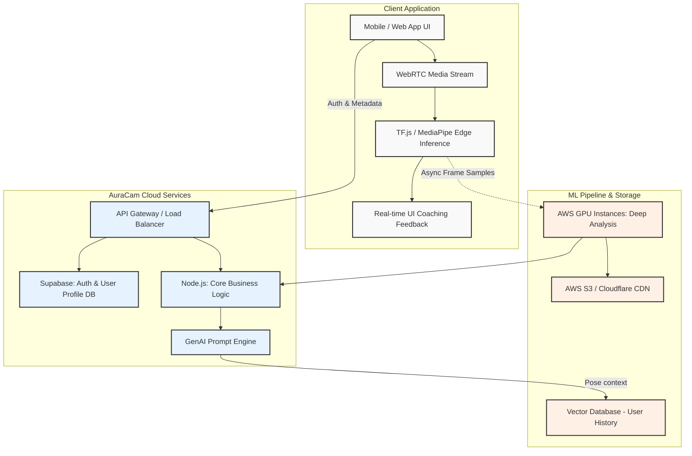
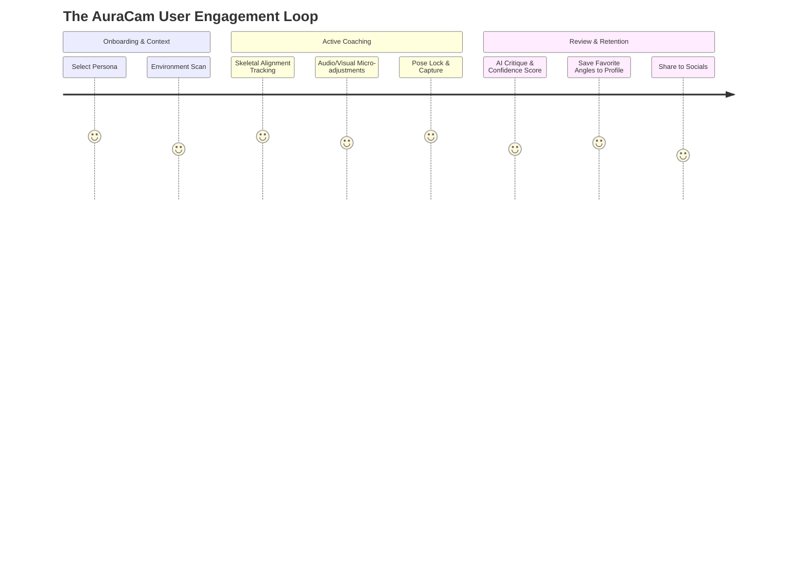

# AuraCam: The Future of Photographic Intelligence

## The Vision: Elevate Human Expression
For decades, the camera has evolved—from film to digital, from standalone devices to the smartphones in our pockets. Yet, the person in front of the lens has been left behind. Currently, billions of photos are taken daily, but the vast majority of people feel stiff, unnatural, and uncertain of how to present their best selves. Existing tools like PoStyle, Pik Pose, or SnapPose rely on static, rigid overlays. Advanced hardware features like Google Pixel's Camera Coach offer basic compositional framing but lack deep, personalized human coaching. 

AuraCam is not a template app. It is a next-generation AI photography coaching SaaS. We are bridging the gap between hardware capabilities and human confidence by providing real-time, dynamic, algorithmic pose and lighting guidance. Our platform coaches you dynamically, learning your best angles, evaluating lighting conditions in real-time, and communicating adjustments intuitively—like a professional photographer in your pocket.

### Unique Value Propositions
*   **Dynamic, Context-Aware Coaching:** Moving beyond static templates to continuous real-time skeletal and facial tracking.
*   **Environmental Synthesis:** Active lighting and composition analysis that directs the user to simply turn, step back, or change angles for optimal exposure.
*   **Personalization Engine:** A machine learning pipeline that understands the user's facial geometry and body type over time, providing highly tailored advice.
*   **The Pro-Tier Confidence Metric:** Analyzing micro-expressions to guide the user toward genuine, relaxed emotion rather than forced smiles.

### User Personas & Use Cases
*   **The Professional Authority:** LinkedIn users, executives, and founders needing high-trust, authoritative headshots without hiring a studio.
*   **The Creator Class:** Influencers and digital creators who require rapid, consistent, high-end content generation.
*   **The Milestone Capturer:** Individuals capturing weddings, graduations, or dating profile photos where visual presentation directly impacts personal outcomes.

### Sustainable Competitive Advantage
While Pixel Camera Coach is inherently tied to a hardware upgrade cycle and focuses on the camera operator, AuraCam is hardware-agnostic and operator-independent, focusing entirely on the subject. By operating as a cross-platform SaaS, AuraCam compounds its value through a proprietary dataset of user coaching interactions, creating an ever-improving personalization moat that offline, template-based apps cannot replicate.

---

## World-Class Technical Architecture

To deliver real-time, low-latency coaching without compromising device battery or privacy, AuraCam employs an Edge-to-Cloud Hybrid Inference Architecture.

### Core Stack
*   **Edge Processing (Client):** WebRTC for media streaming, TensorFlow.js and Google MediaPipe for instantaneous on-device pose estimation and micro-expression tracking. 
*   **Cloud Backend:** Node.js microservices orchestrated on AWS (EKS), handling business logic, session management, and stateful coaching memory.
*   **Database & Auth:** Supabase for rapid iteration on user profiles, authentication, and structured relational data.
*   **Heavy ML Inference:** Python-based FastAPI services deployed on GPU-backed AWS instances for asynchronous high-fidelity image analysis (e.g., precise lighting breakdown).
*   **Storage & CDN:** AWS S3 integrated with Cloudflare for rapid delivery of coaching assets, history, and optimized media rendering.

### System Architecture Diagram

---

## AI & UX Integration Strategy

The barrier to entry for AI tools is UI friction. AuraCam translates complex skeletal joint data into invisible, intuitive coaching.

### Integration Vectors
*   **The "Hot-Cold" Spatial UI:** Instead of technical grids, the UI uses color gradients and gentle haptic feedback to guide the user into frame.
*   **Conversational / Audio Coaching:** Hands-free vocal directions ("Turn your chin slightly left", "Move into the light source").
*   **The Review Cycle:** A post-capture "Before/After" screen highlighting structural improvements (e.g., "Notice how squaring your shoulders improved authority").

### UX Flow Diagram

---

## GenAI Prompt Engineering Protocol

AuraCam leverages foundational models to interpret high-fidelity frames when the Edge system flags a "near-perfect" pose that requires final refinement. 

### Core Evaluation Prompt Example
**System Context:** 
You are a master portrait photographer and posing coach with decades of experience shooting magazine covers and professional executive headshots. 

**Task:** 
Analyze this user frame along four dimensions: Pose Structure, Facial Expression, Lighting Distribution, and Composition. 

**Execution:**
Provide an analysis that is highly actionable, human-readable, and free of technical jargon. Output exactly three short sentences. Start with validation, follow with a specific adjustment, and end with the impact of that adjustment.

**Input Variables:**
*   [User Intended Use Case: "Corporate Headshot"]
*   [Edge Model Joint Data: "Left shoulder elevated 5 degrees relative to right"]
*   [Edge Model Light Data: "Heavy shadow on the right hemisphere of the face"]

**Example AI Output:**
"Your posture communicates great energy, but the uneven lighting is hiding your expression. Shift your body slightly to face the window to bring out the details in your eyes. This simple turn will make you look instantly more approachable and professional."

---

## Growth, Content & SEO Strategy

Building a lasting SaaS requires capturing intent before the user ever touches the camera. Our growth strategy relies on product-led SEO and high-conversion loops.

### Top-of-Funnel Defensibility
*   **Thematic SEO Hubs:** Developing programmatic pages around hyper-specific intent. Example: "How to pose for a LinkedIn headshot as a female executive."
*   **Free-Tier Utilities:** A web-based "Profile Picture Grader" that scores existing photos, immediately demonstrating the need for AuraCam's active coaching to improve the score.
*   **Creator Partnerships:** Distributing specific "Coaching Packs" (e.g., "The Fashion Influencer Pack") curated by top photographers.

### Content Calendar Blueprint
*   **Month 1-3:** High-volume "How to" technical photography guides optimized for search.
*   **Month 4-6:** Case studies—Before and After transformations using AuraCam, distributed natively on professionals' and creators' platforms.
*   **Month 7-12:** UGC (User Generated Content) campaigns, incentivizing viral sharing of "AuraCam Behind the Scenes" vs. "Final Results."

---

## Monetization & Pricing Strategy

AuraCam employs a freemium SaaS model optimized for early habituation and high-LTV conversions.

### Subscription Tiers
1.  **Aura Basic (Free):** 
    *   3 basic poses (Standard Portrait, Full Body, Self-Timer guidance).
    *   Watermarked exports.
2.  **Aura Pro ($9.99/month or $79/year):** 
    *   Unlimited dynamic poses.
    *   Advanced lighting coaching.
    *   Personalized AI history (learns your best angles).
    *   High-res watermark-free exports.
3.  **Aura Studio ($29.99/month) - Creator / Business Tier:** 
    *   Custom pose pack creation.
    *   Batch processing and portfolio grading.
    *   Commercial rights and agency integrations.

### Pricing Psychology
We position the $79/year plan against the cost of a single professional photo shoot ($300+). By framing the product as an ongoing professional service rather than a utility app, we justify SaaS multiples and annual upfront commitments.

---

## 24-Month Execution Roadmap

### Phase 1: The Core Loop (Months 1-4)
*   **Milestone:** MVP Launch & Edge Tracking Validation.
*   **Focus:** WebRTC + MediaPipe integration. Optimization for a single primary use case (The LinkedIn Headshot). Setup of foundational Cloud infrastructure.

### Phase 2: The Intelligence Engine (Months 5-9)
*   **Milestone:** Personalization Engine Deployment.
*   **Focus:** Rolling out the vector database to build stateful user history. Integration of the GenAI prompt engine for deep natural language coaching. Launching the "Profile Picture Grader" SEO loop.

### Phase 3: Monetization & Expansion (Months 10-16)
*   **Milestone:** Growth Acceleration & ARR Scaling.
*   **Focus:** Scaling the Aura Pro subscription and launching referral mechanics ("Gift a perfect headshot"). Expanding pose libraries through high-profile creator partnerships.

### Phase 4: Platform Scale (Months 17-24)
*   **Milestone:** Enterprise & B2B Utility.
*   **Focus:** Launching Aura Studio for professionals. Opening API access for dating apps, real estate platforms, or networking sites to integrate AuraCam grading algorithms natively into their user flows.

---

## KPIs & Analytics Metrics

To ensure we are building a world-class platform, we track behavior, engagement, and economics.

*   **Activation Rate:** The percentage of users who complete their first "Guided Capture" within 5 minutes of sign-up.
*   **Coaching Adherence:** The percentage of AI-suggested physical adjustments (e.g., turning left, adjusting height) actually executed by the user before image capture.
*   **Time-to-Value (TTV):** The duration from app launch to the user saving or sharing a successfully captured photograph.
*   **Viral Coefficient (k-factor):** User acquisition generated organically via watermarked exports and direct referral linkage.
*   **Net Revenue Retention (NRR):** Ensuring that cohort retention and account expansion to the Creator tier significantly outpace baseline churn.

---

## Actionable Next Steps

1.  **Architecture Setup:** Provision the basic Supabase environment and define schemas for user pose history and authentication.
2.  **Client Prototyping:** Build a lightweight React/Next.js frontend using WebRTC and TensorFlow.js to benchmark real-time skeletal tracking latency.
3.  **UX Design:** Wireframe the "Hot-Cold" spatial UI gradient system and test the interaction model with target users (e.g., founders and creators).
4.  **Growth Pipeline:** Secure the primary domain, build a high-conversion waitlist landing page, and draft the first iteration of the "Profile Picture Grader" to begin capturing intent.
